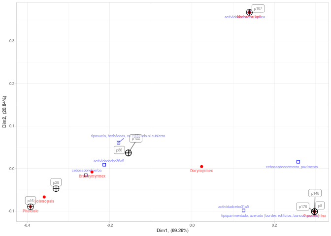
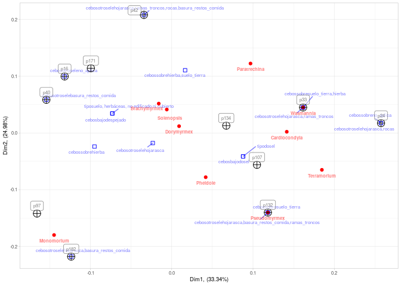

<!-- Este .md fue generado a partir del .Rmd homónimo. Edítese el .Rmd -->

# Análisis exploratorio y de ecología de comunidades

## Carga de funciones y paquetes

``` r
library(tidyverse)
library(knitr)
library(sf)
library(vegan)
library(ade4)
library(FactoMineR)
source('src/funciones_analisis.R')
```

## Carga de datos

``` r
todos_los_habitat <- read.csv('export/tabla_todos_los_habitat.csv')
todos_los_nidos <- read.csv('export/tabla_todos_los_nidos.csv')
mcpooledhabitat <- read.csv('export/mc_pooled_habitat.csv', row.names = 1)
mcpoolednidos <- read.csv('export/mc_pooled_nidos.csv', row.names = 1)
nomlat <- read_csv('equivalencia_etiqueta_nombre_latino.csv')
```

## Análisis exploratorio básico

### Número de parcelas visitadas por persona

``` r
n_parcelas(todos_los_habitat, pooled = F) %>% kable()
```

| Nombre           | Número de parcelas visitadas |
| :--------------- | ---------------------------: |
| bidelkiscastillo |                           11 |
| emdilone         |                           11 |
| jorge-mutonen    |                           11 |
| mangoland        |                           11 |

``` r
n_parcelas(todos_los_nidos, pooled = F) %>% kable()
```

| Nombre      | Número de parcelas visitadas |
| :---------- | ---------------------------: |
| dahianagb07 |                           10 |
| enrique193  |                           13 |
| maritzafg   |                           11 |

### Número de parcelas visitadas, pooled

``` r
n_parcelas(todos_los_habitat, pooled = T) %>% kable()
```

| Número de parcelas visitadas |
| ---------------------------: |
|                           38 |

``` r
n_parcelas(todos_los_nidos, pooled = T) %>% kable()
```

| Número de parcelas visitadas |
| ---------------------------: |
|                           30 |

### Número de muestras por persona

``` r
n_muestras(todos_los_habitat, pooled = F) %>% kable()
```

| Nombre           | Número de muestras |
| :--------------- | -----------------: |
| bidelkiscastillo |                 11 |
| emdilone         |                 11 |
| jorge-mutonen    |                 11 |
| mangoland        |                 11 |

``` r
n_muestras(todos_los_nidos, pooled = F) %>% kable()
```

| Nombre      | Número de muestras |
| :---------- | -----------------: |
| dahianagb07 |                 22 |
| enrique193  |                 23 |
| maritzafg   |                 26 |

### Número de muestras, pooled

``` r
n_muestras(todos_los_habitat, pooled = T) %>% kable()
```

| Número de muestras |
| -----------------: |
|                 44 |

``` r
n_muestras(todos_los_nidos, pooled = T) %>% kable()
```

| Número de muestras |
| -----------------: |
|                 71 |

### Número de muestras por parcela visitada por persona

  - En el caso de hábitat/cebos el resultado es redundante, porque cada
    parcela sólo tenía una muestra.

<!-- end list -->

``` r
n_parcelas_muestras(todos_los_habitat, pooled = F) %>% kable()
```

| Nombre           | parcela | Número de muestras por parcela visitada |
| :--------------- | :------ | --------------------------------------: |
| bidelkiscastillo | p17     |                                       1 |
| bidelkiscastillo | p39     |                                       1 |
| bidelkiscastillo | p53     |                                       1 |
| bidelkiscastillo | p78     |                                       1 |
| bidelkiscastillo | p105    |                                       1 |
| bidelkiscastillo | p122    |                                       1 |
| bidelkiscastillo | p126    |                                       1 |
| bidelkiscastillo | p160    |                                       1 |
| bidelkiscastillo | p169    |                                       1 |
| bidelkiscastillo | p182    |                                       1 |
| bidelkiscastillo | p187    |                                       1 |
| emdilone         | p16     |                                       1 |
| emdilone         | p24     |                                       1 |
| emdilone         | p33     |                                       1 |
| emdilone         | p40     |                                       1 |
| emdilone         | p42     |                                       1 |
| emdilone         | p97     |                                       1 |
| emdilone         | p107    |                                       1 |
| emdilone         | p132    |                                       1 |
| emdilone         | p134    |                                       1 |
| emdilone         | p171    |                                       1 |
| emdilone         | p182    |                                       1 |
| jorge-mutonen    | p25     |                                       1 |
| jorge-mutonen    | p28     |                                       1 |
| jorge-mutonen    | p41     |                                       1 |
| jorge-mutonen    | p44     |                                       1 |
| jorge-mutonen    | p49     |                                       1 |
| jorge-mutonen    | p54     |                                       1 |
| jorge-mutonen    | p64     |                                       1 |
| jorge-mutonen    | p88     |                                       1 |
| jorge-mutonen    | p135    |                                       1 |
| jorge-mutonen    | p158    |                                       1 |
| jorge-mutonen    | p182    |                                       1 |
| mangoland        | p8      |                                       1 |
| mangoland        | p16     |                                       1 |
| mangoland        | p28     |                                       1 |
| mangoland        | p86     |                                       1 |
| mangoland        | p104    |                                       1 |
| mangoland        | p107    |                                       1 |
| mangoland        | p122    |                                       1 |
| mangoland        | p140    |                                       1 |
| mangoland        | p148    |                                       1 |
| mangoland        | p156    |                                       1 |
| mangoland        | p178    |                                       1 |

``` r
n_parcelas_muestras(todos_los_nidos, pooled = F) %>% kable()
```

| Nombre      | parcela | Número de muestras por parcela visitada |
| :---------- | :------ | --------------------------------------: |
| dahianagb07 | p1      |                                       3 |
| dahianagb07 | p10     |                                       3 |
| dahianagb07 | p25     |                                       3 |
| dahianagb07 | p27     |                                       2 |
| dahianagb07 | p42     |                                       2 |
| dahianagb07 | p70     |                                       3 |
| dahianagb07 | p78     |                                       1 |
| dahianagb07 | p147    |                                       2 |
| dahianagb07 | p148    |                                       1 |
| dahianagb07 | p163    |                                       2 |
| enrique193  | p21     |                                       2 |
| enrique193  | p22     |                                       1 |
| enrique193  | p42     |                                       4 |
| enrique193  | p68     |                                       1 |
| enrique193  | p77     |                                       1 |
| enrique193  | p81     |                                       1 |
| enrique193  | p86     |                                       1 |
| enrique193  | p109    |                                       1 |
| enrique193  | p151    |                                       2 |
| enrique193  | p159    |                                       1 |
| enrique193  | p166    |                                       4 |
| enrique193  | p167    |                                       3 |
| enrique193  | p170    |                                       1 |
| maritzafg   | p25     |                                       1 |
| maritzafg   | p27     |                                       8 |
| maritzafg   | p66     |                                       3 |
| maritzafg   | p78     |                                       4 |
| maritzafg   | p106    |                                       1 |
| maritzafg   | p131    |                                       1 |
| maritzafg   | p143    |                                       2 |
| maritzafg   | p157    |                                       1 |
| maritzafg   | p160    |                                       1 |
| maritzafg   | p168    |                                       1 |
| maritzafg   | p179    |                                       3 |

### Número de muestras por parcela visitada, pooled

``` r
n_parcelas_muestras(todos_los_habitat, pooled = T) %>% kable()
```

| parcela | Número de muestras por parcela visitada |
| :------ | --------------------------------------: |
| p8      |                                       1 |
| p16     |                                       2 |
| p17     |                                       1 |
| p24     |                                       1 |
| p25     |                                       1 |
| p28     |                                       2 |
| p33     |                                       1 |
| p39     |                                       1 |
| p40     |                                       1 |
| p41     |                                       1 |
| p42     |                                       1 |
| p44     |                                       1 |
| p49     |                                       1 |
| p53     |                                       1 |
| p54     |                                       1 |
| p64     |                                       1 |
| p78     |                                       1 |
| p86     |                                       1 |
| p88     |                                       1 |
| p97     |                                       1 |
| p104    |                                       1 |
| p105    |                                       1 |
| p107    |                                       2 |
| p122    |                                       2 |
| p126    |                                       1 |
| p132    |                                       1 |
| p134    |                                       1 |
| p135    |                                       1 |
| p140    |                                       1 |
| p148    |                                       1 |
| p156    |                                       1 |
| p158    |                                       1 |
| p160    |                                       1 |
| p169    |                                       1 |
| p171    |                                       1 |
| p178    |                                       1 |
| p182    |                                       3 |
| p187    |                                       1 |

``` r
n_parcelas_muestras(todos_los_nidos, pooled = T) %>% kable()
```

| parcela | Número de muestras por parcela visitada |
| :------ | --------------------------------------: |
| p1      |                                       3 |
| p10     |                                       3 |
| p21     |                                       2 |
| p22     |                                       1 |
| p25     |                                       4 |
| p27     |                                      10 |
| p42     |                                       6 |
| p66     |                                       3 |
| p68     |                                       1 |
| p70     |                                       3 |
| p77     |                                       1 |
| p78     |                                       5 |
| p81     |                                       1 |
| p86     |                                       1 |
| p106    |                                       1 |
| p109    |                                       1 |
| p131    |                                       1 |
| p143    |                                       2 |
| p147    |                                       2 |
| p148    |                                       1 |
| p151    |                                       2 |
| p157    |                                       1 |
| p159    |                                       1 |
| p160    |                                       1 |
| p163    |                                       2 |
| p166    |                                       4 |
| p167    |                                       3 |
| p168    |                                       1 |
| p170    |                                       1 |
| p179    |                                       3 |

### Parcelas visitadas por persona

``` r
parcelas_visitadas(todos_los_habitat, pooled = F) %>% kable()
```

| Nombre           | Parcelas visitadas                                 |
| :--------------- | :------------------------------------------------- |
| bidelkiscastillo | p17,p39,p53,p78,p105,p122,p126,p160,p169,p182,p187 |
| emdilone         | p16,p24,p33,p40,p42,p97,p107,p132,p134,p171,p182   |
| jorge-mutonen    | p25,p28,p41,p44,p49,p54,p64,p88,p135,p158,p182     |
| mangoland        | p8,p16,p28,p86,p104,p107,p122,p140,p148,p156,p178  |

``` r
parcelas_visitadas(todos_los_nidos, pooled = F) %>% kable()
```

| Nombre      | Parcelas visitadas                                        |
| :---------- | :-------------------------------------------------------- |
| dahianagb07 | p1,p10,p25,p27,p42,p70,p78,p147,p148,p163                 |
| enrique193  | p21,p22,p42,p68,p77,p81,p86,p109,p151,p159,p166,p167,p170 |
| maritzafg   | p25,p27,p66,p78,p106,p131,p143,p157,p160,p168,p179        |

### Parcelas visitadas, pooled

``` r
parcelas_visitadas(todos_los_habitat, pooled = T) %>% kable()
```

| Parcelas visitadas                                                                                                                                                       |
| :----------------------------------------------------------------------------------------------------------------------------------------------------------------------- |
| p8,p16,p17,p24,p25,p28,p33,p39,p40,p41,p42,p44,p49,p53,p54,p64,p78,p86,p88,p97,p104,p105,p107,p122,p126,p132,p134,p135,p140,p148,p156,p158,p160,p169,p171,p178,p182,p187 |

``` r
parcelas_visitadas(todos_los_nidos, pooled = T) %>% kable()
```

| Parcelas visitadas                                                                                                                     |
| :------------------------------------------------------------------------------------------------------------------------------------- |
| p1,p10,p21,p22,p25,p27,p42,p66,p68,p70,p77,p78,p81,p86,p106,p109,p131,p143,p147,p148,p151,p157,p159,p160,p163,p166,p167,p168,p170,p179 |

## Mapas

Elige un usuario y una variable, cuantitativa o cualitativa, para crear
mapas y visualizar patrones.

  - Un primer ejemplo con una variable cuantitativa para hábitat, en
    este caso, la riqueza (con riqueza pequeña, se generan muchos rangos
    en leyenda, y sólo son aprovechables los extremos):

<!-- end list -->

``` r
mapa('riqueza', filtusuario = 'bidelkiscastillo')
```

  - En el caso de nidos, dado que en algunos casos hay 2 o más por
    parcela, debes elegir con qué función resumir variables
    cuantitativas.
    
      - Promedio de la riqueza por parcelas
    
    <!-- end list -->
    
    ``` r
    mapa('riqueza', filtusuario = 'dahianagb07', fun = mean)
    ```
    
      - Máxima riqueza por parcelas
    
    <!-- end list -->
    
    ``` r
    mapa('riqueza', filtusuario = 'dahianagb07', fun = max)
    ```

  - Puedes representar variables cualitativas también:
    
      - Un ejemplo con la variable “distancia a basura”:
        
        ``` r
        mapa('distanciaabasura', filtusuario = 'mangoland')
        ```
    
      - El código de muestra es una variable cualitativa, y la puedes
        usar en la representación:
        
        ``` r
        mapa('codigomuestra', filtusuario = 'emdilone')
        ```
    
      - En el caso de los nidos, las variables cualitativas son
        concatenadas dentro de un único vector, separando cada valor (si
        hubiese más de uno) por comas
        
        ``` r
        mapa('codigomuestra', filtusuario = 'enrique193')
        ```

  - Estas son las variables dispnibles:
    
      - Para
        habitat:
        
        ``` r
        colnames(todos_los_habitat) %>% knitr::kable(col.names = 'Variables para hábitat')
        ```
        
        | Variables para hábitat     |
        | :------------------------- |
        | codigomuestra              |
        | parcela                    |
        | usuariohab                 |
        | fechacreacionhab           |
        | fechaenviohab              |
        | idodkhabitat               |
        | horainicio                 |
        | horafinal                  |
        | longitud                   |
        | latitud                    |
        | elevacion                  |
        | precisioncoords            |
        | localidad                  |
        | distanciaabasura           |
        | distanciaagua              |
        | distanciavias              |
        | actividadpersonas          |
        | actividadcebo1             |
        | actividadcebo2             |
        | actividadcebo3             |
        | actividadcebo4             |
        | fechacolecta               |
        | otroscolectores            |
        | observaciones              |
        | plantas                    |
        | idparentalcolec            |
        | siglascolectores           |
        | idparentaltiposdecebo      |
        | tiposdecebo                |
        | idparentalcebosbajo        |
        | cebosbajo                  |
        | idparentalcebossobre       |
        | cebossobre                 |
        | idparentalcebosotrosele    |
        | cebosotrosele              |
        | usuarioident               |
        | fechacreacionident         |
        | fechaenvioident            |
        | idodkident                 |
        | fechaidentificacion        |
        | identificadores            |
        | otrosidentificadores       |
        | idparentalidentificaciones |
        | identificaciones           |
        | tipo                       |
        | riqueza                    |
        

      - Para
        nidos:
        
        ``` r
        colnames(todos_los_nidos) %>% knitr::kable(col.names = 'Variables para nidos')
        ```
        
        | Variables para nidos       |
        | :------------------------- |
        | codigomuestra              |
        | parcela                    |
        | usuarionid                 |
        | fechacreacionnid           |
        | fechaenvionid              |
        | idodknidos                 |
        | horainicio                 |
        | longitud                   |
        | latitud                    |
        | elevacion                  |
        | precisioncoords            |
        | localidad                  |
        | distanciaabasura           |
        | distanciaagua              |
        | distanciavias              |
        | fechacolecta               |
        | otroscolectores            |
        | observaciones              |
        | plantas                    |
        | idparentalcolec            |
        | siglascolectores           |
        | usuarioident               |
        | fechacreacionident         |
        | fechaenvioident            |
        | idodkident                 |
        | fechaidentificacion        |
        | identificadores            |
        | otrosidentificadores       |
        | idparentalidentificaciones |
        | identificaciones           |
        | tipo                       |
        | riqueza                    |
        

  - Estos son los nombres de usuario disponibles:
    
      - Para hábitat:
        
        ``` r
        todos_los_habitat %>% colus() %>% usuarioanombre() %>%
          dplyr::select(usuario=Nombre) %>% distinct() %>% kable()
        ```
        
        | usuario          |
        | :--------------- |
        | bidelkiscastillo |
        | emdilone         |
        | jorge-mutonen    |
        | mangoland        |
        

      - Para nidos:
        
        ``` r
        todos_los_nidos %>% colus() %>% usuarioanombre() %>%
          dplyr::select(usuario=Nombre) %>% distinct() %>% kable()
        ```
        
        | usuario     |
        | :---------- |
        | dahianagb07 |
        | enrique193  |
        | maritzafg   |
        

## Análisis de ecología de comunidades

### Matrices de comunidad y ambiental

Las variables ambientales son diferentes de cebos (que coloquialmente
recibe el nombre de “hábitat”) son ligeramente diferentes a las de
nidos.

En el caso de las muestras tomadas por cebo, las variables ambientales
son las siguientes:

``` r
grep(
  'distancia|hora|colecta|actividad|^cebos|tipo$|plantas',
  colnames(todos_los_habitat),
  value = T)
##  [1] "horainicio"        "horafinal"         "distanciaabasura" 
##  [4] "distanciaagua"     "distanciavias"     "actividadpersonas"
##  [7] "actividadcebo1"    "actividadcebo2"    "actividadcebo3"   
## [10] "actividadcebo4"    "fechacolecta"      "plantas"          
## [13] "cebosbajo"         "cebossobre"        "cebosotrosele"    
## [16] "tipo"
```

Y en el caso de las muestras de nidos, las variables ambientales son
éstas:

``` r
grep(
  'distancia|hora|colecta|actividad|^cebos|tipo$|plantas',
  colnames(todos_los_nidos),
  value = T)
## [1] "horainicio"       "distanciaabasura" "distanciaagua"   
## [4] "distanciavias"    "fechacolecta"     "plantas"         
## [7] "tipo"
```

### Hábitat

#### `mangoland`

Si tus datos son de hábitat (para nidos, lee más abajo), utiliza la
función `matriz_comunidad_hab` para generar una matriz de comunidad, y
la función `matriz_ambiental_hab` para generar una de comunidad, que
contendrá las variables mostras arriba. Sólo tienes que colocar tu
nombre de usuario (usa la referencia anterior sobre los nombres de
usuario disponibles); por ejemplo, para `mangoland`, las matrices se
generarían de la siguiente manera:

``` r
mcmg <- matriz_comunidad_hab('mangoland')
mamg <- matriz_ambiental_hab('mangoland')
mamg <- mamg[match(rownames(mcmg), rownames(mamg)),] #Reordenando filas para que ambas matrices coincidan
```

La
imprimimos:

``` r
mcmg %>% kable
```

|      | Brachymyrmex | Dorymyrmex | Monomorium | Paratrechina | Pheidole | Solenopsis |
| ---- | -----------: | ---------: | ---------: | -----------: | -------: | ---------: |
| p104 |            0 |          0 |          0 |            0 |        0 |          0 |
| p107 |            0 |          1 |          1 |            0 |        0 |          0 |
| p122 |            1 |          1 |          0 |            0 |        0 |          0 |
| p140 |            0 |          0 |          0 |            0 |        0 |          0 |
| p148 |            0 |          1 |          0 |            1 |        0 |          0 |
| p156 |            0 |          0 |          0 |            0 |        0 |          0 |
| p16  |            1 |          1 |          0 |            0 |        1 |          1 |
| p178 |            0 |          1 |          0 |            1 |        0 |          0 |
| p28  |            1 |          1 |          0 |            0 |        0 |          1 |
| p8   |            0 |          1 |          0 |            1 |        0 |          0 |
| p86  |            1 |          1 |          0 |            0 |        0 |          0 |

``` r
mamg %>% kable
```

|      | horainicio | horafinal | distanciaabasura  | distanciaagua     | distanciavias | actividadpersonas | actividadcebo1 | actividadcebo2 | actividadcebo3 | actividadcebo4 | fechacolecta         | plantas                                                                                                            | cebosbajo | cebossobre         | cebosotrosele | tipo                                                    | riqueza |
| ---- | :--------- | :-------- | :---------------- | :---------------- | :------------ | :---------------- | :------------- | :------------- | :------------- | :------------- | :------------------- | :----------------------------------------------------------------------------------------------------------------- | :-------- | :----------------- | :------------ | :------------------------------------------------------ | ------: |
| p104 | 1.05 pm    | 1.38 pm   | 10omas            | no hay a la vista | 1a5           | 1a5               | 0              | 0              | 0              | 0              | 2019-10-12T00:00:00Z | Pocos arbustos (foto) en áreas específicas, con una palma (MacArthur?) en el centro.                               | despejado | cemento\_pavimento | no\_aplica    | pavimentado, acerado (bordes edificios, bancos, postes) |      NA |
| p107 | 11.08 am   | 11.47 pm  | no hay a la vista | no hay a la vista | 6a9           | 0                 | 1a5            | 1a5            | no\_aplica     | no\_aplica     | 2019-10-12T00:00:00Z | Algunas en los bordes del pasto, pero siempre a más de 2 metros de los cebos.                                      | despejado | cemento\_pavimento | no\_aplica    | suelo, herbáceas, no edificado ni cubierto              |       2 |
| p122 | 10.15 am   | 10.56 am  | 10omas            | no hay a la vista | 1a5           | 0                 | 1a5            | 6a9            | 6a9            | 0              | 2019-10-13T00:00:00Z | Cesped, y arbustos borde.                                                                                          | despejado | hierba             | no\_aplica    | suelo, herbáceas, no edificado ni cubierto              |       2 |
| p140 | 10.09 am   | 10.42 am  | 1a5               | no hay a la vista | 1a5           | 0                 | 0              | 0              | 0              | 0              | 2019-10-13T00:00:00Z | No                                                                                                                 | despejado | cemento\_pavimento | no\_aplica    | pavimentado, acerado (bordes edificios, bancos, postes) |      NA |
| p148 | 4.55 pm    | 5.32 pm   | 10omas            | no hay a la vista | 1a5           | 6a9               | 0              | 0              | 1a5            | 0              | 2019-09-14T00:00:00Z | No. Ornamentales al borde (mas de 1 m en un extremo, con muros de cemento).                                        | despejado | cemento\_pavimento | no\_aplica    | pavimentado, acerado (bordes edificios, bancos, postes) |       2 |
| p156 | 12.45 pm   | 1.20 pm   | 10omas            | no hay a la vista | 1a5           | 0                 | 0              | 0              | 0              | 0              | 2019-10-13T00:00:00Z | Arbustos cerca con palma real                                                                                      | despejado | cemento\_pavimento | no\_aplica    | pavimentado, acerado (bordes edificios, bancos, postes) |      NA |
| p16  | 3.19 pm    | 4.20 pm   | 10omas            | no hay a la vista | 1a5           | 0                 | 10omas         | 10omas         | 1a5            | 10omas         | 2019-10-12T00:00:00Z | NULL                                                                                                               | despejado | hierba             | no\_aplica    | suelo, herbáceas, no edificado ni cubierto              |       5 |
| p178 | 6.00 pm    | 6.40 pm   | no hay a la vista | no hay a la vista | 1a5           | 0                 | 6a9            | 10omas         | 1a5            | no\_aplica     | 2019-10-12T00:00:00Z | Ningua. Areas de cesped y ornamentales en márgenes.                                                                | despejado | cemento\_pavimento | no\_aplica    | pavimentado, acerado (bordes edificios, bancos, postes) |       2 |
| p28  | 4.50 pm    | 5.42 pm   | 6a9               | no hay a la vista | 6a9           | 1a5               | 10omas         | 10omas         | 6a9            | 10omas         | 2019-10-12T00:00:00Z | Otras herbaceas que no es el pasto o cesped regular. Cesped recien recortado, pero queda en la base casi completo. | despejado | hierba             | no\_aplica    | suelo, herbáceas, no edificado ni cubierto              |       3 |
| p8   | 9.20 am    | 9.56 am   | 1a5               | no hay a la vista | 1a5           | 1a5               | 0              | 0              | 1a5            | 1a5            | 2019-10-13T00:00:00Z | Fila de Grigri al borde acera calle                                                                                | despejado | cemento\_pavimento | hojarasca     | pavimentado, acerado (bordes edificios, bancos, postes) |       2 |
| p86  | 12.45 pm   | 1.33 pm   | 10omas            | no hay a la vista | 6a9           | 0                 | 0              | 1a5            | 6a9            | 0              | 2019-10-12T00:00:00Z | NULL                                                                                                               | despejado | hierba             | no\_aplica    | suelo, herbáceas, no edificado ni cubierto              |       2 |

Con ambas matrices se pueden realizar múltiples análisis exploratorios.
Lo básico:

``` r
mcmg %>% rowSums %>% length #Número de individuos por parcela
## [1] 11
mcmg %>% specnumber #Número de géneros por parcela
## p104 p107 p122 p140 p148 p156  p16 p178  p28   p8  p86 
##    0    2    2    0    2    0    4    2    3    2    2
mcmg %>% specnumber %>% sort #Número de géneros por parcela ordenados ascendentemente
## p104 p140 p156 p107 p122 p148 p178   p8  p86  p28  p16 
##    0    0    0    2    2    2    2    2    2    3    4
mcmg %>% colSums %>% specnumber #Número de géneros total (pooled)
## [1] 6
mcmg %>% rowSums %>% table #Número de parcelas según conteo de géneros (e.g. 3 parcelas con 0, etc.)
## .
## 0 2 3 4 
## 3 6 1 1
mcmg %>% colSums %>% sort #Número de parcelas en las que aparece cada género. Dorymyrmex, generalista
##   Monomorium     Pheidole   Solenopsis Paratrechina Brachymyrmex 
##            1            1            2            3            4 
##   Dorymyrmex 
##            8
```

Una curva de acumulación de especies revela algo sobre la riqueza
esperada.

``` r
mcmg_sac <- specaccum(mcmg)
plot(mcmg_sac, ci.type="polygon", ci.col="yellow")
```

<!-- -->

Aunque el intervalo de confianza es horrible, y denota que la muestra es
pequeña, parecería razonable asumir que más del 60% de la riqueza
esperada por géneros fue alcanzada en esta muestra de `mangoland`.

Si se realiza el análisis para el conjunto de los datos combinados
(*pooled*), se obtendrían mejores reusltados.

``` r
mcpooledhabitat_sac <- specaccum(mcpooledhabitat)
plot(mcpooledhabitat_sac, ci.type="polygon", ci.col="yellow")
```

<!-- -->

A juzgar por la forma de la curva de acumulación de especies de todas
las muestras combinadas (11 géneros encontrados), donde el extremo
derecho se vuelve asintótico, no parece posible encontrar mucho más de
11 o 12 géneros por medio de cebos, incluso aumentando
significativamente el esfuerzo de
muestreo.

##### Ordenación: dendrograma y Análisis de Coordenadas Principales (PCoA)

Obtener matrices de comunidad y ambiental para ordenación. La matriz de
comunidad se transforma por medio del método “Hellinger”. La matriz
ambiental es similar a la original, pero se seleccionan sólo aquellas
columnas con potencial asociación con los datos de comunidad.

``` r
mcmg_ord <- mc_para_ord(filtusuario = 'mangoland')
mcmg_ord %>% kable
```

|      | Brachymyrmex | Dorymyrmex | Monomorium | Paratrechina | Pheidole | Solenopsis |
| ---- | -----------: | ---------: | ---------: | -----------: | -------: | ---------: |
| p107 |    0.0000000 |  0.7071068 |  0.7071068 |    0.0000000 |      0.0 |  0.0000000 |
| p122 |    0.7071068 |  0.7071068 |  0.0000000 |    0.0000000 |      0.0 |  0.0000000 |
| p148 |    0.0000000 |  0.7071068 |  0.0000000 |    0.7071068 |      0.0 |  0.0000000 |
| p16  |    0.5000000 |  0.5000000 |  0.0000000 |    0.0000000 |      0.5 |  0.5000000 |
| p178 |    0.0000000 |  0.7071068 |  0.0000000 |    0.7071068 |      0.0 |  0.0000000 |
| p28  |    0.5773503 |  0.5773503 |  0.0000000 |    0.0000000 |      0.0 |  0.5773503 |
| p8   |    0.0000000 |  0.7071068 |  0.0000000 |    0.7071068 |      0.0 |  0.0000000 |
| p86  |    0.7071068 |  0.7071068 |  0.0000000 |    0.0000000 |      0.0 |  0.0000000 |

``` r
mamg_ord <- ma_para_ord(filtusuario = 'mangoland', mc = mcmg_ord)
mamg_ord %>% kable
```

|      | riqueza | tipo                                                    | distanciaabasura  | distanciaagua     | distanciavias | actividadpersonas | actividadcebo1 | actividadcebo2 | actividadcebo3 | actividadcebo4 | cebosbajo | cebossobre         | cebosotrosele |
| ---- | ------: | :------------------------------------------------------ | :---------------- | :---------------- | :------------ | :---------------- | :------------- | :------------- | :------------- | :------------- | :-------- | :----------------- | :------------ |
| p107 |       2 | suelo, herbáceas, no edificado ni cubierto              | no hay a la vista | no hay a la vista | 6a9           | 0                 | 1a5            | 1a5            | no\_aplica     | no\_aplica     | despejado | cemento\_pavimento | no\_aplica    |
| p122 |       2 | suelo, herbáceas, no edificado ni cubierto              | 10omas            | no hay a la vista | 1a5           | 0                 | 1a5            | 6a9            | 6a9            | 0              | despejado | hierba             | no\_aplica    |
| p148 |       2 | pavimentado, acerado (bordes edificios, bancos, postes) | 10omas            | no hay a la vista | 1a5           | 6a9               | 0              | 0              | 1a5            | 0              | despejado | cemento\_pavimento | no\_aplica    |
| p16  |       5 | suelo, herbáceas, no edificado ni cubierto              | 10omas            | no hay a la vista | 1a5           | 0                 | 10omas         | 10omas         | 1a5            | 10omas         | despejado | hierba             | no\_aplica    |
| p178 |       2 | pavimentado, acerado (bordes edificios, bancos, postes) | no hay a la vista | no hay a la vista | 1a5           | 0                 | 6a9            | 10omas         | 1a5            | no\_aplica     | despejado | cemento\_pavimento | no\_aplica    |
| p28  |       3 | suelo, herbáceas, no edificado ni cubierto              | 6a9               | no hay a la vista | 6a9           | 1a5               | 10omas         | 10omas         | 6a9            | 10omas         | despejado | hierba             | no\_aplica    |
| p8   |       2 | pavimentado, acerado (bordes edificios, bancos, postes) | 1a5               | no hay a la vista | 1a5           | 1a5               | 0              | 0              | 1a5            | 1a5            | despejado | cemento\_pavimento | hojarasca     |
| p86  |       2 | suelo, herbáceas, no edificado ni cubierto              | 10omas            | no hay a la vista | 6a9           | 0                 | 0              | 1a5            | 6a9            | 0              | despejado | hierba             | no\_aplica    |

Dendrograma:

``` r
dendro(mc = mcmg_ord, k = 4)
```

<!-- -->

PCoA. Leer la [leyenda de símbolos](#leyendasimbolos) a continuación del
gráfico, también denominado “*biplot*”:

``` r
pcoa_mg <- pcoagg(mc = mcmg_ord, ma = mamg_ord, textoetiq = 2)
pcoa_mg$grafico
```



<a name="leyendasimbolos"></a>Leyenda de símbolos:

Los tres símbolos empleados reflejan las posiciones de tres tipos de
objetos: géneros, sitios y variables, utilizando las puntuaciones
(*scores*) de cada uno en el espacio bidimensional. En este escalado, la
distancia entre cada objeto es inversamente proporcional a su relación.
Por lo tanto, objetos próximos reflejan algún grado de relación entre sí
dentro de la muestra. En el caso que nos ocupa, dado que se trata de
pocas muestras, y por el hecho de que las variables son mayoritariamente
cuantitativas, sobre un mismo punto es posible que solapen distintos
símbolos; reconoce cuando aparezcan de forma combinada.

Leyenda de
objetos:

|                            |                                           |
| :------------------------: | :---------------------------------------: |
|    |  <span style="color:red">géneros</span>   |
|     |                  sitios                   |
|  | <span style="color:blue">variables</span> |

#### `emdilone`

``` r
mcemdilone <- matriz_comunidad_hab('emdilone')
maemdilone <- matriz_ambiental_hab('emdilone')
maemdilone <- maemdilone[match(rownames(mcemdilone), rownames(maemdilone)),]
```

``` r
mcemdilone %>% kable
```

|      | Brachymyrmex | Cardiocondyla | Dorymyrmex | Monomorium | Paratrechina | Pheidole | Pseudomyrmex | Solenopsis | Tetramorium | Wasmannia |
| ---- | -----------: | ------------: | ---------: | ---------: | -----------: | -------: | -----------: | ---------: | ----------: | --------: |
| p107 |            0 |             1 |          1 |          0 |            0 |        1 |            0 |          1 |           0 |         0 |
| p132 |            0 |             0 |          1 |          0 |            0 |        1 |            1 |          1 |           1 |         0 |
| p134 |            1 |             1 |          0 |          0 |            0 |        1 |            0 |          1 |           0 |         0 |
| p16  |            1 |             0 |          1 |          0 |            0 |        0 |            0 |          0 |           0 |         0 |
| p171 |            1 |             0 |          1 |          0 |            0 |        0 |            0 |          1 |           0 |         0 |
| p182 |            0 |             0 |          1 |          1 |            0 |        1 |            0 |          0 |           0 |         0 |
| p24  |            1 |             1 |          1 |          0 |            1 |        1 |            0 |          0 |           1 |         0 |
| p33  |            1 |             1 |          1 |          0 |            0 |        1 |            0 |          1 |           0 |         1 |
| p40  |            0 |             0 |          0 |          0 |            0 |        0 |            0 |          1 |           0 |         0 |
| p42  |            1 |             0 |          1 |          0 |            1 |        0 |            0 |          1 |           0 |         0 |
| p97  |            1 |             0 |          0 |          1 |            0 |        1 |            0 |          0 |           0 |         0 |

``` r
maemdilone %>% kable
```

|      | horainicio | horafinal | distanciaabasura | distanciaagua     | distanciavias | actividadpersonas | actividadcebo1 | actividadcebo2 | actividadcebo3 | actividadcebo4 | fechacolecta         | plantas                | cebosbajo | cebossobre           | cebosotrosele                                         | tipo                                       | riqueza |
| ---- | :--------- | :-------- | :--------------- | :---------------- | :------------ | :---------------- | :------------- | :------------- | :------------- | :------------- | :------------------- | :--------------------- | :-------- | :------------------- | :---------------------------------------------------- | :----------------------------------------- | ------: |
| p107 | 4.14 pm    | 5.29 pm   | 10omas           | no hay a la vista | 1a5           | 0                 | 6a9            | 1a5            | 0              | 1a5            | 2019-10-13T00:00:00Z | Mango                  | despejado | hierba               | hojarasca                                             | suelo, herbáceas, no edificado ni cubierto |       4 |
| p132 | 3.35 pm    | 4.56 pm   | 1a5              | no hay a la vista | 1a5           | 0                 | 10omas         | 10omas         | 10omas         | 10omas         | 2019-10-26T00:00:00Z | Nin                    | dosel     | suelo\_tierra        | hojarasca,basura\_restos\_comida,ramas\_troncos       | dosel                                      |       5 |
| p134 | 11.24 am   | 12.51 pm  | 10omas           | no hay a la vista | 1a5           | 0                 | 10omas         | 10omas         | 10omas         | 10omas         | 2019-10-24T00:00:00Z | Palma                  | dosel     | hierba,suelo\_tierra | hojarasca                                             | dosel                                      |       4 |
| p16  | 10.28 am   | 11.38 am  | 10omas           | no\_aplica        | 1a5           | 1a5               | 1a5            | 10omas         | 0              | 1a5            | 2019-10-12T00:00:00Z | Mango, coco            | despejado | hierba               | no\_aplica                                            | suelo, herbáceas, no edificado ni cubierto |       2 |
| p171 | 2.03 pm    | 3.04 pm   | 1a5              | no hay a la vista | 1a5           | 0                 | 10omas         | 10omas         | 10omas         | 10omas         | 2019-10-14T00:00:00Z | Framboyan, pino, palma | despejado | hierba               | hojarasca                                             | suelo, herbáceas, no edificado ni cubierto |       3 |
| p182 | 4.47 pm    | 6.15 pm   | 10omas           | no hay a la vista | 1a5           | 0                 | 10omas         | 6a9            | 10omas         | 10omas         | 2019-09-27T00:00:00Z | NULL                   | despejado | hierba               | hojarasca,basura\_restos\_comida                      | suelo, herbáceas, no edificado ni cubierto |       3 |
| p24  | 3.03 pm    | 5.57 pm   | 1a5              | no hay a la vista | 1a5           | 0                 | 10omas         | 10omas         | 10omas         | 10omas         | 2019-10-13T00:00:00Z | Almendra               | dosel     | no\_aplica           | hojarasca,rocas                                       | dosel                                      |       6 |
| p33  | 11.43 am   | 12.51 pm  | 10omas           | no hay a la vista | 1a5           | 0                 | 10omas         | 10omas         | 10omas         | 10omas         | 2019-10-25T00:00:00Z | NULL                   | dosel     | suelo\_tierra,hierba | hojarasca,ramas\_troncos                              | dosel                                      |       6 |
| p40  | 12.06 pm   | 12.57 pm  | 6a9              | no hay a la vista | 1a5           | 0                 | 0              | 0              | 10omas         | 0              | 2019-10-12T00:00:00Z | NULL                   | despejado | hierba               | basura\_restos\_comida                                | suelo, herbáceas, no edificado ni cubierto |       1 |
| p42  | 10.14 am   | 11.32 am  | 10omas           | no hay a la vista | 6a9           | 0                 | 10omas         | 10omas         | 10omas         | 10omas         | 2019-10-25T00:00:00Z | NULL                   | despejado | hierba,suelo\_tierra | hojarasca,ramas\_troncos,rocas,basura\_restos\_comida | suelo, herbáceas, no edificado ni cubierto |       4 |
| p97  | 3.40 pm    | 4.51 pm   | 1a5              | no hay a la vista | 1a5           | no\_aplica        | 10omas         | 10omas         | 6a9            | 10omas         | 2019-10-14T00:00:00Z | Pino, framboyan        | dosel     | hierba               | hojarasca                                             | dosel                                      |       3 |

Análisis exploratorios básicos:

``` r
mcemdilone %>% rowSums %>% length #Número de individuos por parcela
## [1] 11
mcemdilone %>% specnumber #Número de géneros por parcela
## p107 p132 p134  p16 p171 p182  p24  p33  p40  p42  p97 
##    4    5    4    2    3    3    6    6    1    4    3
mcemdilone %>% specnumber %>% sort #Número de géneros por parcela ordenados ascendentemente
##  p40  p16 p171 p182  p97 p107 p134  p42 p132  p24  p33 
##    1    2    3    3    3    4    4    4    5    6    6
mcemdilone %>% colSums %>% specnumber #Número de géneros total (pooled)
## [1] 10
mcemdilone %>% rowSums %>% table #Número de parcelas según conteo de géneros
## .
## 1 2 3 4 5 6 
## 1 1 3 3 1 2
mcemdilone %>% colSums %>% sort #Número de parcelas en las que aparece cada género
##  Pseudomyrmex     Wasmannia    Monomorium  Paratrechina   Tetramorium 
##             1             1             2             2             2 
## Cardiocondyla  Brachymyrmex      Pheidole    Solenopsis    Dorymyrmex 
##             4             7             7             7             8
```

Curva de acumulación de especies:

``` r
mcemdilone_sac <- specaccum(mcemdilone)
plot(mcemdilone_sac, ci.type="polygon", ci.col="yellow")  
```

<!-- -->

##### Ordenación: dendrograma y PCoA

Generar matrices de comunidad y ambiental para ordenación:

``` r
mcem_ord <- mc_para_ord(filtusuario = 'emdilone')
mcem_ord %>% kable
```

|      | Brachymyrmex | Cardiocondyla | Dorymyrmex | Monomorium | Paratrechina |  Pheidole | Pseudomyrmex | Solenopsis | Tetramorium | Wasmannia |
| ---- | -----------: | ------------: | ---------: | ---------: | -----------: | --------: | -----------: | ---------: | ----------: | --------: |
| p107 |    0.0000000 |     0.5000000 |  0.5000000 |  0.0000000 |    0.0000000 | 0.5000000 |    0.0000000 |  0.5000000 |   0.0000000 | 0.0000000 |
| p132 |    0.0000000 |     0.0000000 |  0.4472136 |  0.0000000 |    0.0000000 | 0.4472136 |    0.4472136 |  0.4472136 |   0.4472136 | 0.0000000 |
| p134 |    0.5000000 |     0.5000000 |  0.0000000 |  0.0000000 |    0.0000000 | 0.5000000 |    0.0000000 |  0.5000000 |   0.0000000 | 0.0000000 |
| p16  |    0.7071068 |     0.0000000 |  0.7071068 |  0.0000000 |    0.0000000 | 0.0000000 |    0.0000000 |  0.0000000 |   0.0000000 | 0.0000000 |
| p171 |    0.5773503 |     0.0000000 |  0.5773503 |  0.0000000 |    0.0000000 | 0.0000000 |    0.0000000 |  0.5773503 |   0.0000000 | 0.0000000 |
| p182 |    0.0000000 |     0.0000000 |  0.5773503 |  0.5773503 |    0.0000000 | 0.5773503 |    0.0000000 |  0.0000000 |   0.0000000 | 0.0000000 |
| p24  |    0.4082483 |     0.4082483 |  0.4082483 |  0.0000000 |    0.4082483 | 0.4082483 |    0.0000000 |  0.0000000 |   0.4082483 | 0.0000000 |
| p33  |    0.4082483 |     0.4082483 |  0.4082483 |  0.0000000 |    0.0000000 | 0.4082483 |    0.0000000 |  0.4082483 |   0.0000000 | 0.4082483 |
| p40  |    0.0000000 |     0.0000000 |  0.0000000 |  0.0000000 |    0.0000000 | 0.0000000 |    0.0000000 |  1.0000000 |   0.0000000 | 0.0000000 |
| p42  |    0.5000000 |     0.0000000 |  0.5000000 |  0.0000000 |    0.5000000 | 0.0000000 |    0.0000000 |  0.5000000 |   0.0000000 | 0.0000000 |
| p97  |    0.5773503 |     0.0000000 |  0.0000000 |  0.5773503 |    0.0000000 | 0.5773503 |    0.0000000 |  0.0000000 |   0.0000000 | 0.0000000 |

``` r
maem_ord <- ma_para_ord(filtusuario = 'emdilone', mc = mcem_ord)
maem_ord %>% kable
```

|      | riqueza | tipo                                       | distanciaabasura | distanciaagua     | distanciavias | actividadpersonas | actividadcebo1 | actividadcebo2 | actividadcebo3 | actividadcebo4 | cebosbajo | cebossobre           | cebosotrosele                                         |
| ---- | ------: | :----------------------------------------- | :--------------- | :---------------- | :------------ | :---------------- | :------------- | :------------- | :------------- | :------------- | :-------- | :------------------- | :---------------------------------------------------- |
| p107 |       4 | suelo, herbáceas, no edificado ni cubierto | 10omas           | no hay a la vista | 1a5           | 0                 | 6a9            | 1a5            | 0              | 1a5            | despejado | hierba               | hojarasca                                             |
| p132 |       5 | dosel                                      | 1a5              | no hay a la vista | 1a5           | 0                 | 10omas         | 10omas         | 10omas         | 10omas         | dosel     | suelo\_tierra        | hojarasca,basura\_restos\_comida,ramas\_troncos       |
| p134 |       4 | dosel                                      | 10omas           | no hay a la vista | 1a5           | 0                 | 10omas         | 10omas         | 10omas         | 10omas         | dosel     | hierba,suelo\_tierra | hojarasca                                             |
| p16  |       2 | suelo, herbáceas, no edificado ni cubierto | 10omas           | no\_aplica        | 1a5           | 1a5               | 1a5            | 10omas         | 0              | 1a5            | despejado | hierba               | no\_aplica                                            |
| p171 |       3 | suelo, herbáceas, no edificado ni cubierto | 1a5              | no hay a la vista | 1a5           | 0                 | 10omas         | 10omas         | 10omas         | 10omas         | despejado | hierba               | hojarasca                                             |
| p182 |       3 | suelo, herbáceas, no edificado ni cubierto | 10omas           | no hay a la vista | 1a5           | 0                 | 10omas         | 6a9            | 10omas         | 10omas         | despejado | hierba               | hojarasca,basura\_restos\_comida                      |
| p24  |       6 | dosel                                      | 1a5              | no hay a la vista | 1a5           | 0                 | 10omas         | 10omas         | 10omas         | 10omas         | dosel     | no\_aplica           | hojarasca,rocas                                       |
| p33  |       6 | dosel                                      | 10omas           | no hay a la vista | 1a5           | 0                 | 10omas         | 10omas         | 10omas         | 10omas         | dosel     | suelo\_tierra,hierba | hojarasca,ramas\_troncos                              |
| p40  |       1 | suelo, herbáceas, no edificado ni cubierto | 6a9              | no hay a la vista | 1a5           | 0                 | 0              | 0              | 10omas         | 0              | despejado | hierba               | basura\_restos\_comida                                |
| p42  |       4 | suelo, herbáceas, no edificado ni cubierto | 10omas           | no hay a la vista | 6a9           | 0                 | 10omas         | 10omas         | 10omas         | 10omas         | despejado | hierba,suelo\_tierra | hojarasca,ramas\_troncos,rocas,basura\_restos\_comida |
| p97  |       3 | dosel                                      | 1a5              | no hay a la vista | 1a5           | no\_aplica        | 10omas         | 10omas         | 6a9            | 10omas         | dosel     | hierba               | hojarasca                                             |

Dendrograma:

``` r
dendro(mc = mcem_ord, k = 4)
```

<!-- -->

PCoA:

``` r
pcoa_em <- pcoagg(mc = mcem_ord, ma = maem_ord, distmethod = 'gower', textoetiq = 2, p_max = 0.2)
pcoa_em$grafico
```


